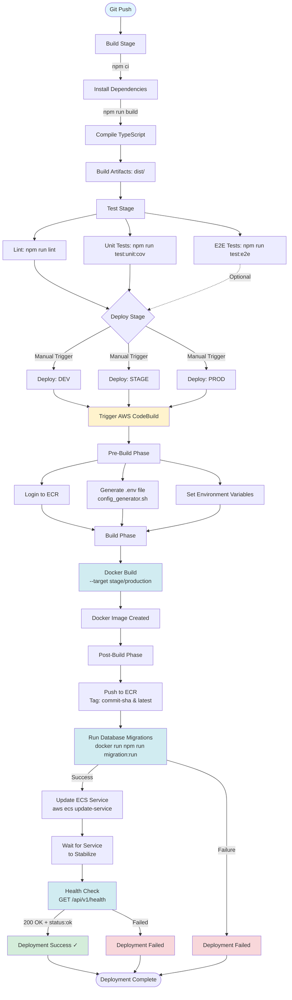

# CI/CD Pipeline Flow Diagram

## Mermaid Diagram

```mermaid
graph TB
    Start([Git Push]) --> Build[Build Stage]
    
    Build --> |npm ci| InstallDeps[Install Dependencies]
    InstallDeps --> |npm run build| Compile[Compile TypeScript]
    Compile --> BuildArtifacts[Build Artifacts: dist/]
    
    BuildArtifacts --> Test[Test Stage]
    
    Test --> Lint[Lint: npm run lint]
    Test --> UnitTest[Unit Tests: npm run test:unit:cov]
    Test --> E2ETest[E2E Tests: npm run test:e2e]
    
    Lint --> Deploy{Deploy Stage}
    UnitTest --> Deploy
    E2ETest -.->|Optional| Deploy
    
    Deploy --> |Manual Trigger| DeployDev[Deploy: DEV]
    Deploy --> |Manual Trigger| DeployStage[Deploy: STAGE]
    Deploy --> |Manual Trigger| DeployProd[Deploy: PROD]
    
    DeployDev --> CodeBuild[Trigger AWS CodeBuild]
    DeployStage --> CodeBuild
    DeployProd --> CodeBuild
    
    CodeBuild --> PreBuild[Pre-Build Phase]
    
    PreBuild --> ECRLogin[Login to ECR]
    PreBuild --> GenEnv[Generate .env file<br/>config_generator.sh]
    PreBuild --> SetVars[Set Environment Variables]
    
    ECRLogin --> BuildPhase[Build Phase]
    GenEnv --> BuildPhase
    SetVars --> BuildPhase
    
    BuildPhase --> DockerBuild[Docker Build<br/>--target stage/production]
    DockerBuild --> DockerImage[Docker Image Created]
    
    DockerImage --> PostBuild[Post-Build Phase]
    
    PostBuild --> PushECR[Push to ECR<br/>Tag: commit-sha & latest]
    
    PushECR --> RunMigrations[Run Database Migrations<br/>docker run npm run migration:run]
    
    RunMigrations --> |Success| UpdateECS[Update ECS Service<br/>aws ecs update-service]
    RunMigrations --> |Failure| MigFail[Deployment Failed]
    
    UpdateECS --> WaitStable[Wait for Service<br/>to Stabilize]
    
    WaitStable --> HealthCheck[Health Check<br/>GET /api/v1/health]
    
    HealthCheck --> |200 OK + status:ok| Success[Deployment Success ✓]
    HealthCheck --> |Failed| HealthFail[Deployment Failed]
    
    Success --> End([Deployment Complete])
    MigFail --> End
    HealthFail --> End
    
    style Start fill:#e1f5ff
    style Success fill:#d4edda
    style MigFail fill:#f8d7da
    style HealthFail fill:#f8d7da
    style CodeBuild fill:#fff3cd
    style DockerBuild fill:#d1ecf1
    style RunMigrations fill:#d1ecf1
    style HealthCheck fill:#d1ecf1
```